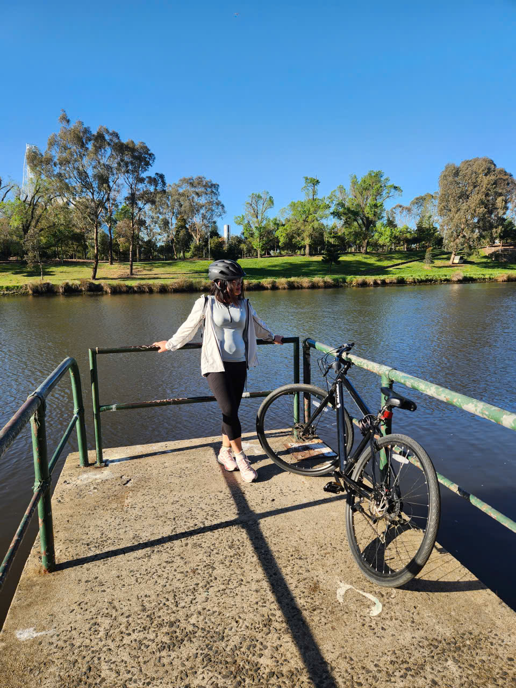
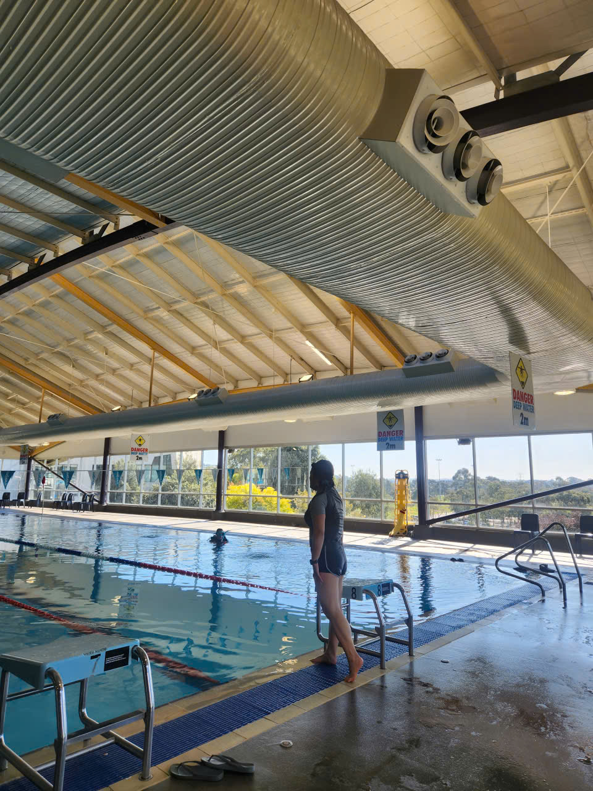
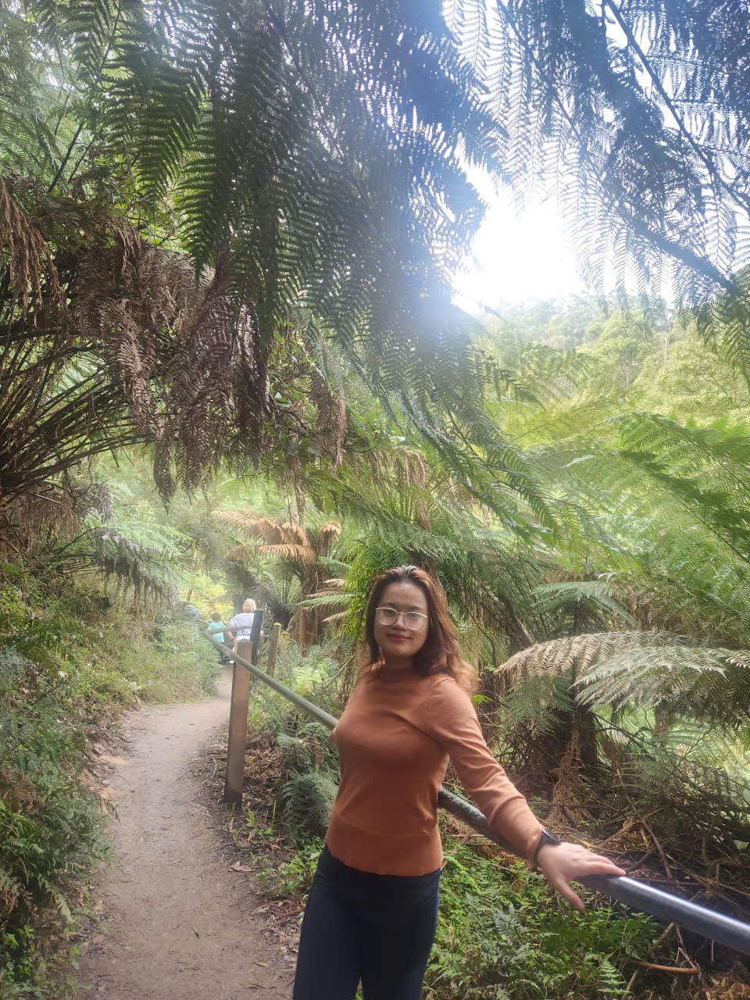
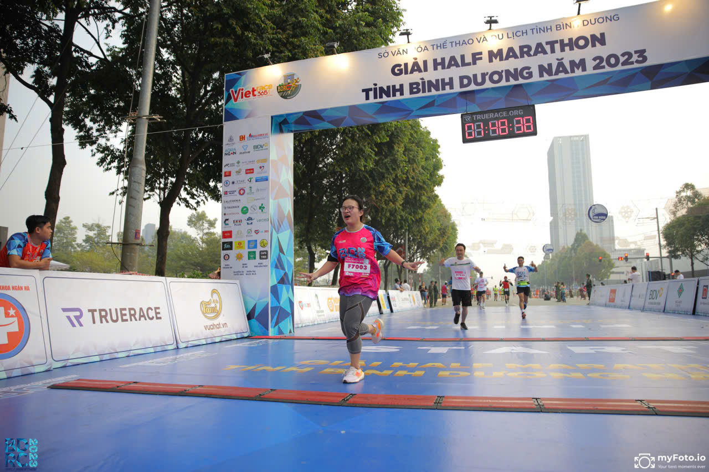
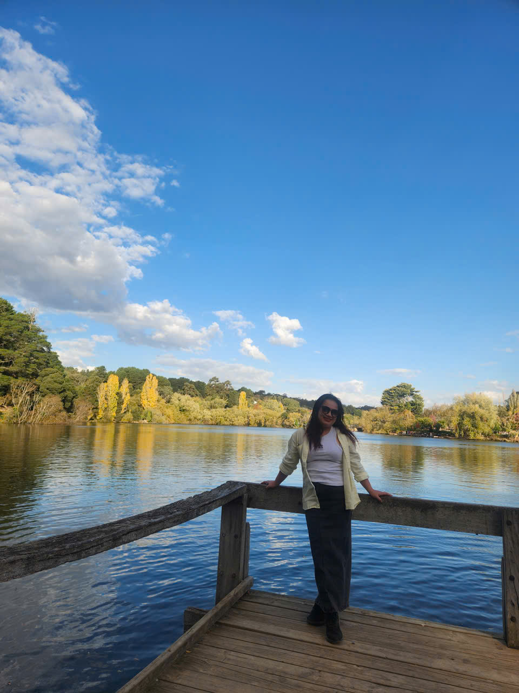
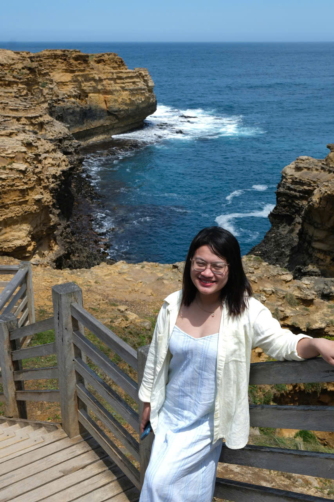
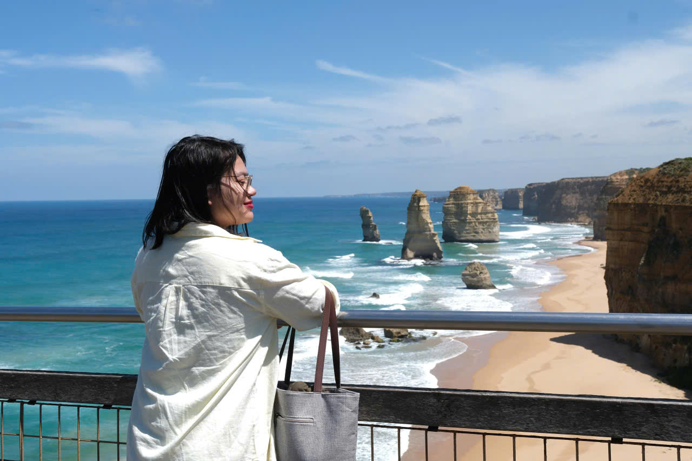
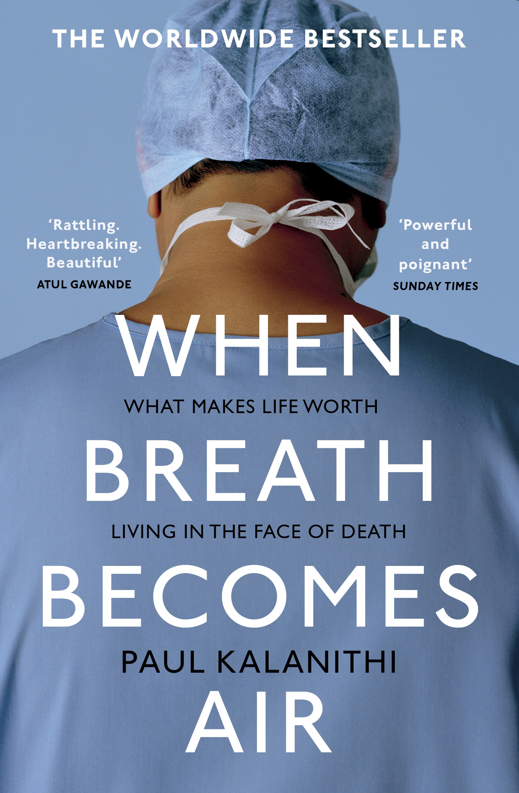
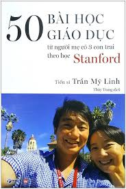

# About Me

Hi, I'm **Alissa Tran**.

I am a graduate of Master of Data Science on a journey to become a **Data Scientist** who can turn raw data into insights and real-world impact. I’m especially interested in how **Data and AI** can help solve practical problems in areas like business, education, and everyday life.

---

## Education

- 🎓 **Master of Data Science**  
  *Deakin University — 2023-2025*  
  Achieved all High-Distinction in courses

- 🎓**Graduate Diploma in Statistics**  
  *Victoria University of Wellington — 2017-2019*
  
  6/8 courses achieved A+

- 🎓 **Bachelor of Business Administration**  
  *Foreign Trade Univeristy — 2012-2016*
  
  Top 10 graduated students of the Faculty
  
  GPA:3.64/4

  

---

## Experience
### **Intern** - *Deakin AI Institue*
**Nov 2025 - present**  
- Supporting big data analysis of trading data between Australia and other partners around the world.
- Using LLM to figure out factors affecting the trading beheviour between countries.
- Doing research on deep learning, supervised learning and unsupervised learning to understand the factors influencing the trading behaviors between countries.
  

### **Data analysis volunteer**  - *Cultura*
**Nov 2025 - present**  
- Collecting relevant data of Colac Otway on immigrants profile to help create reports on the immigrants in Colac
- Analyzing data of immigrants profile in Colac in aspects: population, the original nationality of immigrants, the second languages they speak at home, .et
- Collaborating with the manager to prepare a final report aggregating all information and data analysis about Colac Otway.

---

### **Data Scientst** — *VNG Corporation - Zalo*  
**Apr 2020 - March 2023**  
- Developed analytics reports on user activity, ad clicks, and CTR distribution for managerial insights. 
- Conducted bid pricing and CTR analysis, improving ad cost efficiency  by 20% and CTR by 12%.
- Uncovered hidden insights, explaining metric fluctuations and contributing to a 30% reduction in unexplained variances.
- Implemented ML models (Logistic Regression, XGBoost, Random Forest), optimizing the ad serving algorithm and improving ad targeting accuracy by 18%.
- Managed 100+ data requests, ensuring timely and accurate cross-functional data delivery.

## My Interests

In terms of academic and professional interests, I am passionate about **Mathematics, Coding, Technology, AI, and Data**. I hope to apply **AI and Big Data** to solve real-world problems that matter.  

Since high school, I have always felt fascinated by mathematics — especially logic, patterns, and problem-solving. I achieved **Third Prize twice in the National Mathematics Contest**, which strengthened my confidence in analytical thinking. When I discovered Data and AI and realized how powerful they could be in real applications, I knew this was the path I wanted to pursue. My long-term dream is to become a **Data Scientist**.

Outside of academics, I am an energetic person who loves sports — especially **swimming, running, badminton, and pickleball**. I believe training the body is similar to training the mind: a healthy body supports a strong mindset and good mental health.

  

    
    
<em>Riding and enjoying beautiful landscapes make me feel happy</em>

  

  

    
    
<em>Go swimming in a cold day</em>

  

  

    
    
<em> Go jogging in a forest</em>

  

  

    
    
<em>First time I finished a 10 km running</em>

  

I also love **traveling and discovering new places**. Since coming to Australia, I have been amazed by its natural beauty — truly unlike anywhere else in the world.

  

    
    
<em>Going to Dalesford in an autumn day</em>

  

  

    
    
<em>Travel to Great Ocean Road</em>

  

  

    
    
<em> 12 Apostales in Great Ocean Road </em>

  

Reading is another big part of my life. I enjoy **novels** and **self-help books**. For me, reading opens new perspectives and rewires the mind. It is also why I enjoy **writing journals** — to reflect, track my growth, and understand myself better.
Some of my favourite books:

  

    
    
<em>When the Breath Becomes Air is a memoir by Paul Kalanithi, a gifted neurosurgeon who is diagnosed with terminal lung cancer in his mid-thirties, just as he is about to complete a decade of medical training. The book explores what it means to live a meaningful life when you know that life will be cut short. I got deeply touched with the story of the writer as well his dedication and passion in neurosurgery and writing</em>

  

  

    
    
<em>This is the book "50 education lessons from a mother having 3 children studying at Stanford". The mother is an education doctor My Linh Tran. The book is concise lessons of how to raise confident children and treasure each individual characters but also making up a closely knitted family that always support each other. I am highly impressed by the author's concise, compact writing style and the profound educational philosophies reflected in the book."</em>

  

  

    
    
<em>Fresh Water for Flowers by Valérie Perrin is a quiet, emotional novel about grief, love, and finding a way back to life after tragedy. I am highly touched with the novel’s poetic, beautiful prose describing the life of Violette Toussaint — a woman with her life marked by loss and hardship, yet still filled with happiness in the small, simple things around."  </em>

  

